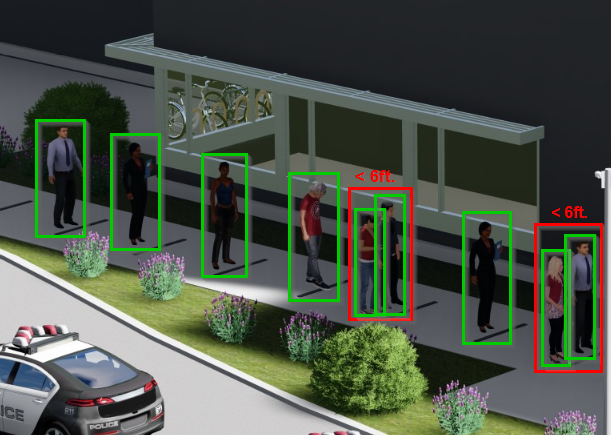
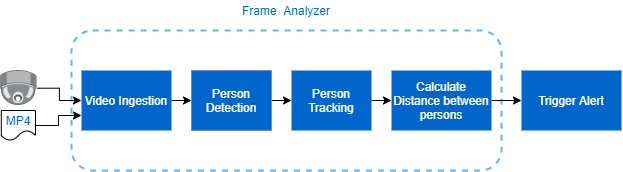

# Retail Pandemic Reference Implementation - Social Distance

| Details               |              |
|-----------------------|---------------|
| Target OS:            |  Ubuntu\* 18.04 LTS   |
| Programming Language: |  Python* 3.5 |
| Time to Complete:     |  1 hour     |



## What it does

This reference implementation showcases a retail social distance application that detects people and measures the distance between them. If this distance is less than a value previously provided by the user, then an alert is triggered.

## Requirements

### Hardware

* 6th gen or greater Intel® Core™ processors or Intel® Xeon® processor, with 8Gb of RAM

### Software

* [Ubuntu 18.04](http://releases.ubuntu.com/18.04/)

* [Intel® Distribution of OpenVINO™ toolkit 2020.3 Release](https://software.intel.com/content/www/us/en/develop/tools/openvino-toolkit.html)

## How It works

The application uses the Inference Engine and Model Downloader included in the Intel® Distribution of OpenVINO Toolkit doing the following steps:

1. Ingests video from a file, processing it frame by frame.
2. Detects people in the frame of interest using a DNN model.
3. Extract features from detected people to track them by using a second DNN model.
4. Calculates the distance between detected people based on each person’s location, size and perspective, to identify if the minimum social distancing threshold is violated.

The DNN models are optimized for Intel® architecture and are included with Intel Distribution of OpenVINO™ toolkit.



## Setup

### Get the code

Clone the reference implementation:

```bash
sudo apt-get update && sudo apt-get install git
git clone github.com:intel-iot-devkit/social-distance.git
```

### Install Python requirements

```bash
pip3 install -r requirements.txt
```

### Install Intel® Distribution of OpenVINO™ Toolkit

Refer to https://software.intel.com/en-us/articles/OpenVINO-Install-Linux for more information about how to install and setup the Intel® Distribution of OpenVINO™ toolkit.

### Installing the requirements

To install the dependencies of the Reference Implementation, run the following commands:

```bash
cd <path-to-social-distance-directory>
pip3 install -r requirements.txt
```

### Which model to use

This application uses the [person-detection-retail-0013](https://docs.openvinotoolkit.org/2020.3/_models_intel_person_detection_retail_0013_description_person_detection_retail_0013.html) and [person-reidentification-retail-0300](https://docs.openvinotoolkit.org/2020.3/_models_intel_person_reidentification_retail_0300_description_person_reidentification_retail_0300.html) Intel® pre-trained models, that can be downloaded using the **model downloader**. The **model downloader** downloads the __.xml__ and __.bin__ files that is used by the application.

To install the dependencies of the RI and to download the models Intel® model, run the following command:

```bash
mkdir models
cd models
python3 /opt/intel/openvino/deployment_tools/open_model_zoo/tools/downloader/downloader.py --name person-detection-retail-0013 --precisions FP32
python3 /opt/intel/openvino/deployment_tools/open_model_zoo/tools/downloader/downloader.py --name person-reidentification-retail-0300 --precisions FP32
```

The models will be downloaded inside the following directories:

```bash
- models/intel/person-detection-retail-0013/FP32/
- models/intel/person-reidentification-retail-0300/FP32/
```

### The Config File

The _config.json_ contains the path to the videos and models that will be used by the application.

The _config.json_ file is of the form name/value pair.

Example of the _config.json_ file:

```bash
{
  "video": "path/to/video/myvideo.mp4",
  "pedestrian_model_weights": "models/intel/person-detection-retail-0013/FP32/person-detection-retail-0013.bin",
  "pedestrian_model_description": "models/intel/person-detection-retail-0013/FP32/person-detection-retail-0013.xml",
  "reidentification_model_weights": "models/intel/person-reidentification-retail-0300/FP32/person-reidentification-retail-0300.bin",
  "reidentification_model_description": "models/intel/person-reidentification-retail-0300/FP32/person-reidentification-retail-0300.xml",
  "coords": [[0, 0], [0, 100], [100, 100], [100, 0]]
}
```

### Which Input video to use

The application works with any input video format supported by [OpenCV](https://opencv.org/). Find sample videos [here](https://github.com/intel-iot-devkit/sample-videos/).  

Sample videos also may be available on platforms such as https://videos.pexels.com (e.g., https://www.pexels.com/video/black-and-white-video-of-people-853889/), subject to the terms and conditions for use of the applicable platform. Intel does not endorse the use of, or grant any rights to, any particular platform, video, or data.

To use the video, specify the path in config.json file

## Setup the environment

You must configure the environment to use the Intel® Distribution of OpenVINO™ toolkit one time per session by running the following command:

```bash
source /opt/intel/openvino/bin/setupvars.sh -pyver 3.5
```

__Note__: This command needs to be executed only once in the terminal where the application will be executed. If the terminal is closed, the command needs to be executed again.

## Run the application

Change the current directory to the project location on your system:

```bash
cd <path-to-social-distance-directory>/src
```

Run the python script.

```bash
python3 socialdistance.py
```